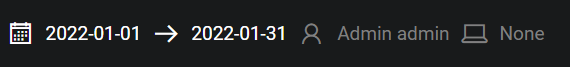
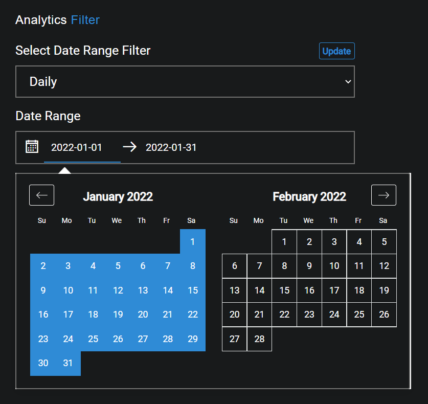

## Description
The purpose of Applicatin Usage page is to show the user the amount of time spend in specific categories set up by the company or user.

## Date Range
The Start and End dates can be edited by clicking on the Calendar or dates.

{ loading=lazy  }

Select the desired date range and click on Update in order to display the recorded data for the selected timeframe.

{ loading=lazy  }

## Graph
The graph displayed after the date range has been selected will show the user information regarding to aspects such as Actual Hours and Valid Hours.

{ loading=lazy  }

The key data elements are broken down and explained at the top of the graph.

- #### Total Category
The total categories present within the selected time period.

- #### Total Hours
The total number of hours within the selected time period.

- #### Actual Hours
The actual number of hours spent in valid applications within the selected time period.

- #### Valid Hours
The number of valid hours spent actually working in valid applications within the selected time period.

??? example "Hover states"
    - Category: The name of the category the user is currently hovering over.
    - Total Hours: The total percentage of hours within the hovered over category.
    - Actual Hours: The percentage of actual hours spent in valid applications within the hovered over category.
    - Valid Hours: The percentage of valid hours spent actually working in valid applications within the hovered over category.

## Pie Chart
The pie chart is rendered with the graph and displays the data from all categories in their own pie charts

{ loading=lazy  }