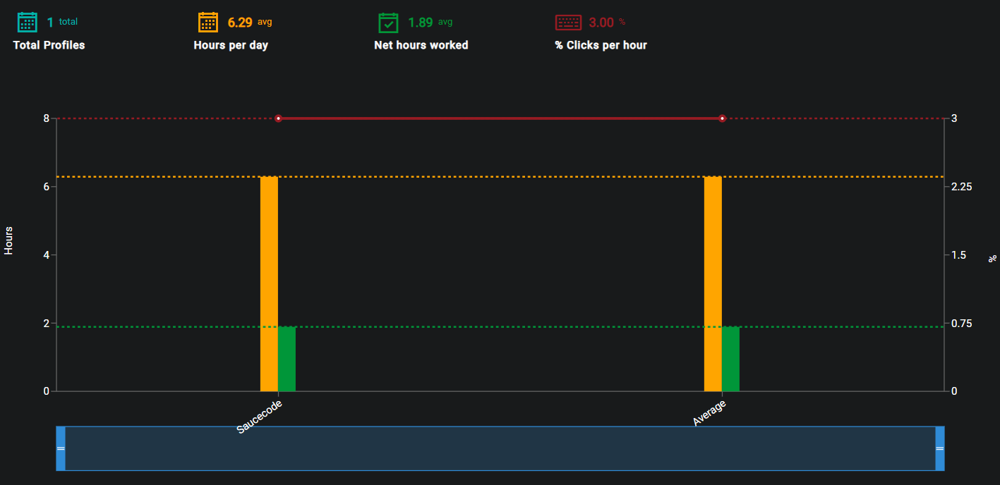
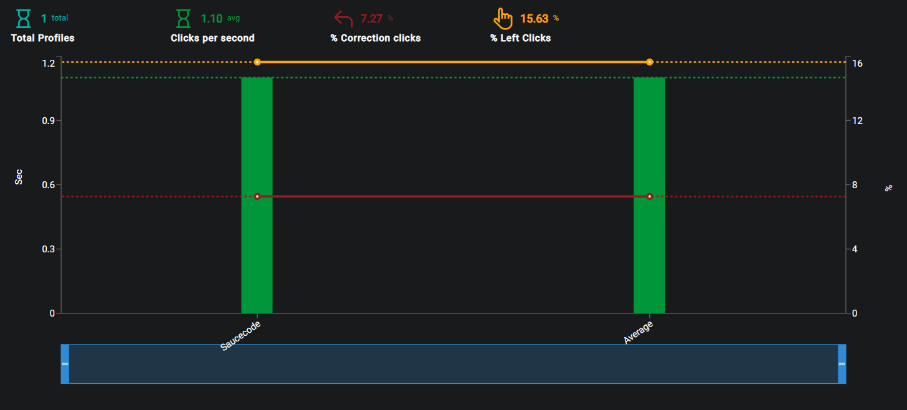

## Description
The purpose of the Department Activity page is to display user activity across multiple registered departments.

## Date Range
The Start and End dates can be edited by clicking on the Calendar or dates.

{ loading=lazy  }

Select the desired date range and click on Update in order to display the recorded data for the selected timeframe.

{ loading=lazy  }

## Graph
The graph will display all registered departments and compare their efficiency.

{ loading=lazy  }

The key data elements are broken down and explained at the top of the graph.

- #### Total Profiles
The total number of profiles present within the selected time period.

- #### Hours per day
The average number of hours per day within the selected time period.

- #### Net hours worked
The average net hours worked within the selected time period.

- #### Percentage clicks per hour
The percentage clicks per hour within the selected time period.

??? example "Hover states"
    - Profile: The name of the profile the user is currently hovering over.
    - Hours per day: The number of hours per day for the hovered over profile.
    - Net hours worked: The average net hours worked for the hovered over profile.
    - Percentage clicks per hour: The percentage clicks per hour for the hovered over profile.

## 2nd Graph
The graph will display additional information regarding registered departments.

{ loading=lazy  }

The key data elements are broken down and explained at the top of the graph.

- #### Total Profiles
The total number of profiles present within the selected time period.

- #### Clicks per second
The average number clicks per second within the selected time period.

- #### Percentage correction clicks
The percentage of correction clicks performend within the selected time period.

- #### Percentage left clicks
The percentage left clicks performed within the selected time period.

??? example "Hover states"
    - Profile: The name of the profile the user is currently hovering over.
    - Clicks per second: The number of clicks per second for the hovered over profile.
    - Correction clicks: The percentage of correction clicks for the hovered over profile.
    - Percentage left clicks: The percentage left clicks performed for the hovered over profile.