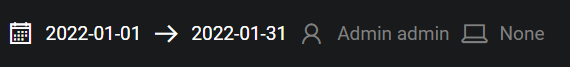
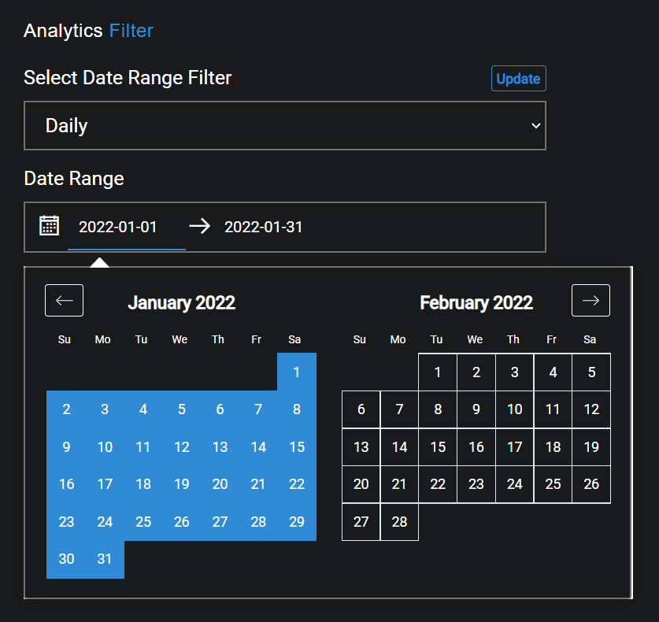
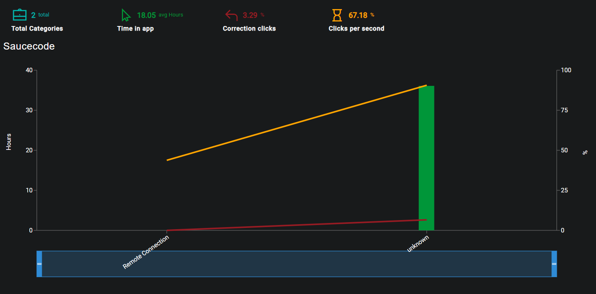

## Description
The purpose of the Department Performance page is to display user activity over multiple categories.

## Date Range
The Start and End dates can be edited by clicking on the Calendar or dates.

{ loading=lazy  }

Select the desired date range and click on Update in order to display the recorded data for the selected timeframe.

{ loading=lazy  }

## Graph
The graph will display all registered categories and compare time spent in them.

{ loading=lazy  }

The key data elements are broken down and explained at the top of the graph.

- #### Total Categories
The total number of categories present within the selected time period.

- #### Time in app
The average time in hours spent in applications within the selected time period.

- #### Correction clicks
The percentage correction clicks made within the selected time period.

- #### Clicks per second
The percentage clicks per second within the selected time period.

??? example "Hover states"
    - Category: The name of the category the user is currently hovering over.
    - Time in app: The number of hours spent in the the hovered over cateogry's applications.
    - Correction clicks: The percentage if correction clicks made within the hovered over category's applications.
    - Clicks per second: The percentage clicks per second made in the hovered over category's applications.