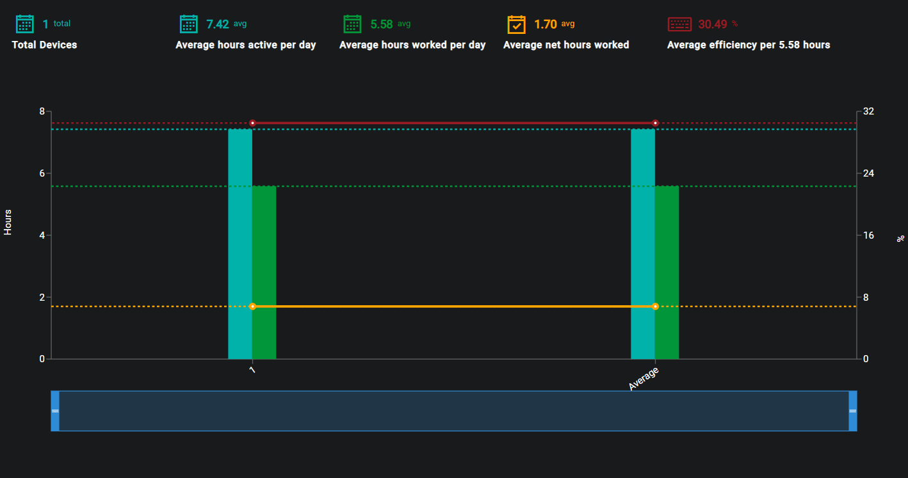

## Description
The purpose of the Device Activity page is to show the user the device activity across all regestered devices.

## Date Range
The Start and End dates can be edited by clicking on the Calendar or dates.

{ loading=lazy  }

Select the desired date range and click on Update in order to display the recorded data for the selected timeframe.

{ loading=lazy  }

## Graph
The graph will display all registered devices, you can view the device names by clicking the Show Users button in the top left corner. All device activity will be monitored and compared within this graph.

{ loading=lazy  }

The key data elements are broken down and explained at the top of the graph.

- #### Total devices
This is the total registered devices within the selected time period.

- #### Average active hours per day
This is the average number of active hours per day within the selected time period.

- #### Average hours worked per day
This is the average number of hours worked per day within the selected time period.

- #### Average net hours worked
This is the average hours worked within the selected time period.

- #### Average efficiency per X hours
This is the average efficiency per X hours (the average hours worked per day).

??? example "Hover states"
    - Device: The name of the device the user is hovering over.
    - Average active hours per day: This is the average number of active hours per day within the selected time period for the hovered over device.
    - Average hours worked per day: This is the average number of hours worked per day within the selected time period for the hovered over device.
    - Average net hours worked: This is the average hours worked within the selected time period for the hovered over device.
    - Average efficiency per X hours: This is the average efficiency per X hours (the average hours worked per day).
