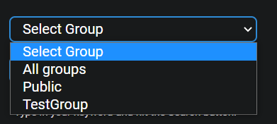
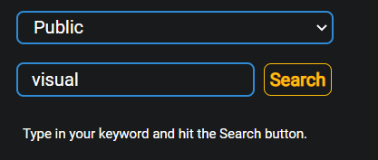

## Description
The purpose of the Keyword Report page is to allow the user to search for keywords within groups and have a response of browser searches and applications used that contain said keyword.

## Date Range
The Start and End dates can be edited by clicking on the Calendar or dates.

{ loading=lazy  }

Select the desired date range and click on Update in order to display the recorded data for the selected timeframe.

{ loading=lazy  }

## Select Group
Here is a dropdown which contains all registered groups within the company. Select one from this list to be able to search for keywords.

{ loading=lazy  }

## Search for keyword
After the group has been selected the user can type the keyword into the search bar and click on Search. The user will then get a list of applications and browser searches containing the keyword.

{ loading=lazy  }