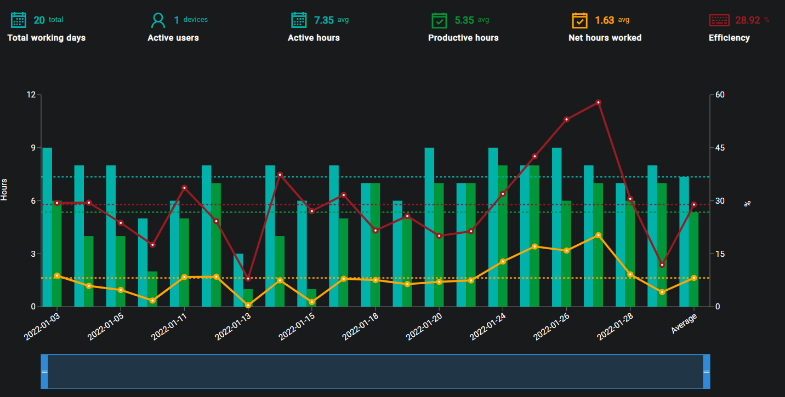

## Description
The purpose of the Analytics Overview page it to give the user a overview of the overall activity of all registered devices within a selected time period.

## Date Range
The Start and End dates can be edited by clicking on the Calendar or dates.

{ loading=lazy  }

Select the desired date range and click on Update in order to display the recorded data for the selected timeframe.

{ loading=lazy  }

## Graph
The graph displayed after the date range has been selected will show the user information regarding to aspects such as Active Hours and Productive Hours.

{ loading=lazy  }

The key data elements are broken down and explained at the top of the graph.

- #### Total working days
This is the number of valid working days within the selected time period.

- #### Active users
This is the number of registered active users within the selected time period.

- #### Active hours
This is the average for active hours within the selected time period.

- #### Productive hours
This is the average for productive hours within the selected time period.

- #### Net hours worked
This is the average for net hours worked within the seletced time period.

- #### Efficiency
This is the percenatge efficency witin the selected time period.

??? example "Hover states"
    - Working Day: The current date of the hovered over entry.
    - Active Devices: The active devices in the current hovered over entry.
    - Working Hours Present: The working hours present on the hovered over entry.
    - Hours Actually Working: The amount of hours actually wokring on the hovered over entry.
    - Net Hours Worked: The net hours worked on the hovered over entry.
    - avg Efficiency per X hours: X hours depending on the Working hours present on the hovered over entry.