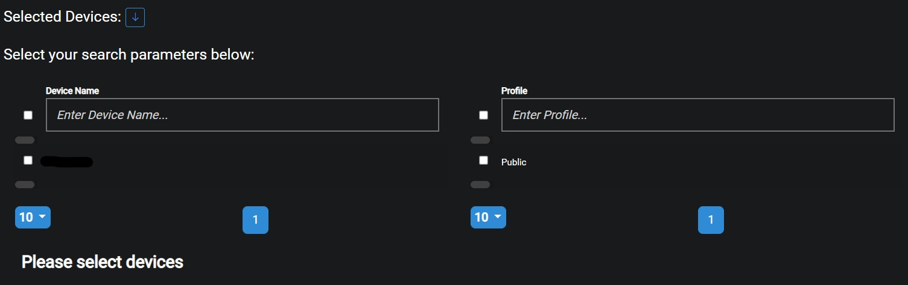
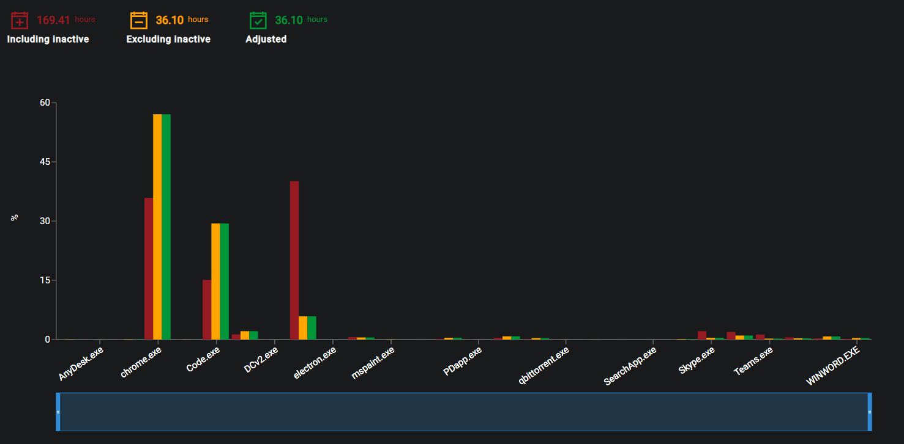
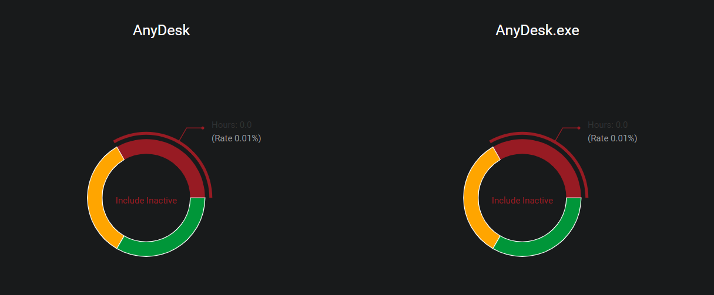

## Description
The purpose of the Application Usage page is to show the user the application usage for the selected devices or profiles.

## Date Range
The Start and End dates can be edited by clicking on the Calendar or dates.

{ loading=lazy  }

Select the desired date range and click on Update in order to display the recorded data for the selected timeframe.

{ loading=lazy  }

## Select Devices
After a date range has been selected the user then has to select devices or profiles from the presented lsit in order to render the data.

{ loading=lazy  }

After the devices or profiles have been selected the user then has to click on the Run button

{ loading=lazy  }

## Bar chart
Once the data is loaded from the selected devices the bar chart will show the user the applications used as well as the time spent in them.

{ loading=lazy  }

- #### Including inactive
This is the total time spent in applications including inactivity within the selected time period.

- #### Excluding inactive
This is the total time spent in applications excluding inactivity within the selected time period.

- #### Adjusted
This adjusted time spent in applications within the selected time period.

## Pie chart
Below the Bar chart there are pie charts for each application listed, giving an alternative look at the time spent in an application.

{ loading=lazy  }