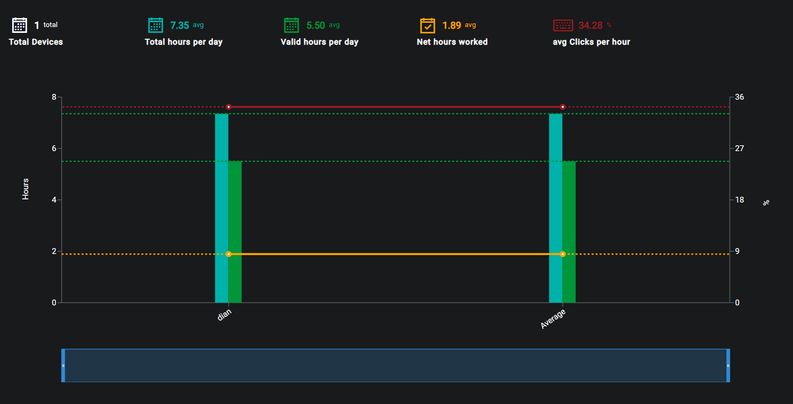

## Description
The purpose of the Device Activity page is to display to the user the efficiency of the selected devices or profiles.

## Date Range
The Start and End dates can be edited by clicking on the Calendar or dates.

{ loading=lazy  }

Select the desired date range and click on Update in order to display the recorded data for the selected timeframe.

{ loading=lazy  }

## Select Devices
After a date range has been selected the user then has to select devices or profiles from the presented lsit in order to render the data.

{ loading=lazy  }

After the devices or profiles have been selected the user then has to click on the Run button

{ loading=lazy  }

## Graph
Once the data for the selected devices or profiles is loaded the graph will show the user the hours that each device/profile has worked within the selected time period

{ loading=lazy  }