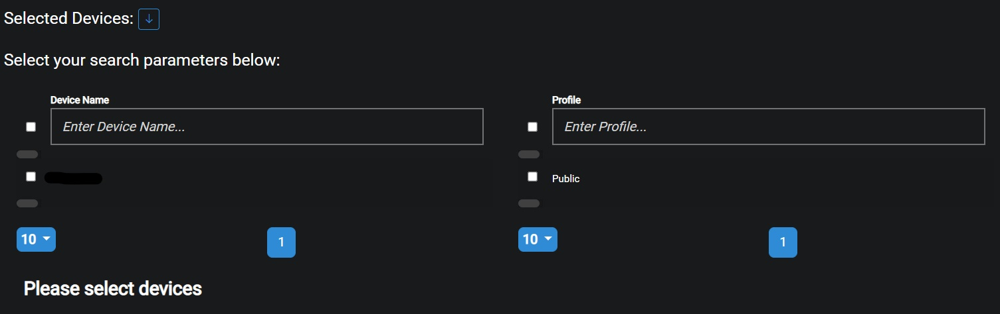

## Description
The purpose of the Overview page is to display the efficientcy of specific devices or profiles that the user selects.

## Date Range
The Start and End dates can be edited by clicking on the Calendar or dates.

{ loading=lazy  }

Select the desired date range and click on Update in order to display the recorded data for the selected timeframe.

{ loading=lazy  }

## Select Devices
After a date range has been selected the user then has to select devices or profiles from the presented lsit in order to render the data.

{ loading=lazy  }

After the devices or profiles have been selected the user then has to click on the Run button

{ loading=lazy  }

## Graph
After the data has been loaded the Overview page will show a graph with the efficiency for the selected devices/profiles.

{ loading=lazy  }

- #### Working days
This is the number of valid working days within the selected time period.

- #### Working hours present
This is the number of working hours the devices have been logging within the selected time period.

- #### Hours actually working
This is the number of hours actually spent in valid applications within the selected time period.

- #### Net hours worked
This is the average for net hours worked within the seletced time period.

- #### Percentage average clicks per hour
This is the average precentage clicks per hour within the seletced time period.

??? example "Hover states"
    - Working Day: The current date of the hovered over entry.
    - Working hours present: The wokring hours present for the current hovered over entry.
    - Hours actually working: The amount of hours spent in valid applications for the hovered over entry.
    - Net hours worked: The net amount of hours worked for the hovered over entry.
    - Percentage clicks per hour: The percentage clicks per hour for the hovered over entry.