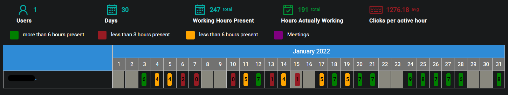
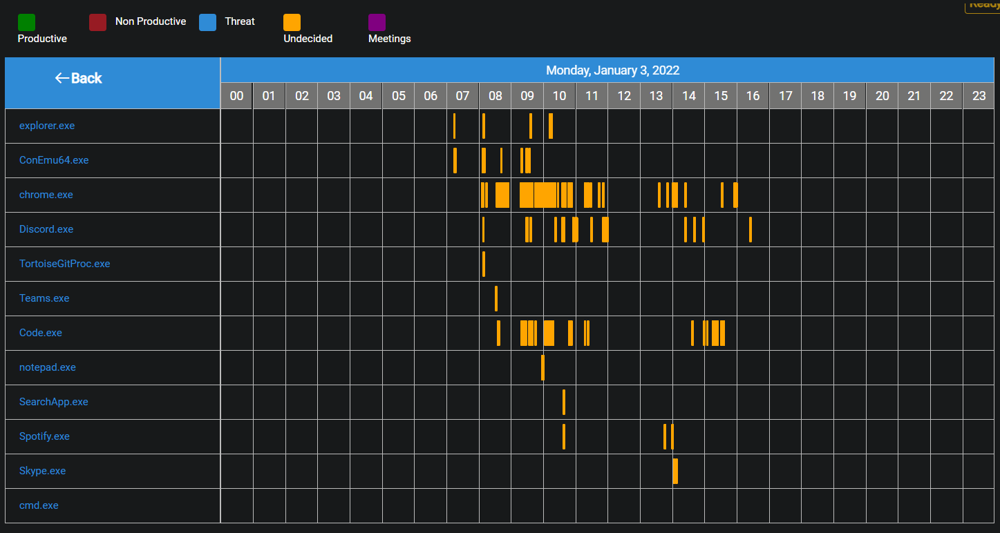

## Description
The purpose of the Timeline view is to provide the user an indepth view of the specifics of what goes on on specific days by allowing the user to click on a day and then select applications to see deeper details.

Warning  
Large date ranges will take much longer and more server resources to load the data.

## Date Range
The Start and End dates can be edited by clicking on the Calendar or dates.

{ loading=lazy  }

Select the desired date range and click on Update in order to display the recorded data for the selected timeframe.

{ loading=lazy  }

## Select Devices
After a date range has been selected the user then has to select devices or profiles from the presented lsit in order to render the data.

{ loading=lazy  }

After the devices or profiles have been selected the user then has to click on the Run button

{ loading=lazy  }

## Timeline
Once the data has been loaded for the selected devices or profiles a table will show with data indicating the Time Spent Actually orking on each day within the timeframe selected.

{ loading=lazy  }

- #### Users
This is the number of users active within the selected time period.

- #### Days
This is the number of days selected for the time period.

- #### Working hours present
This is the working hours present within the selected time period.

- #### Hours actually working
This is the hours spent actually working within the seletced time period.

- #### Clicks per active hour
This is the average clicks per active hour within the seletced time period.

??? example "Hover states"
    - Device Name: The device name of the hovered over entry.
    - Date: The date for the hovered over entry.
    - Working hours present: The working hours present for the hovered over entry.
    - Hours actually working: The hours spent actually working for the hovered over entry.
    - Clicks per hour: The clicks per hour for the hovered over entry.

## Timeline details

On the timeline table the user can click on an entry in order to view specific applications used on that day, that will result in the following table:

{ loading=lazy  }

- #### Productive
This is time spent in productive applications (such as Visual Studio or Excel).

- #### Non Productive
This is time spent in non productive applications (such as Facebook or Games).

- #### Threat
This is time spent in threat applications (such as pornography or illegal applications/sites).

- #### Undecided
This is time spent in applications that have not been registered or are considered neutral (such as reading emails on Gmail).

- #### Meetings
This is time spent in meeting applications (such as Teams or Skype).
